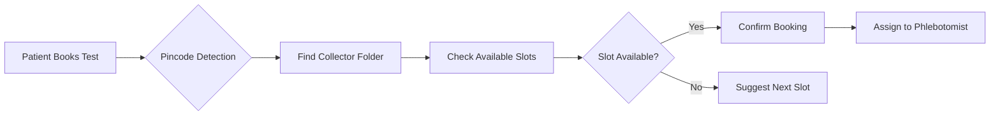

<div align="center">

# 🏥 FutureLabs Diagnostics

### *Advanced Healthcare Platform for Modern Diagnostics*

[](https://opensource.org/licenses/MIT)
[](https://nodejs.org/)
[](https://reactjs.org/)
[](https://www.mongodb.com/)
[](https://expressjs.com/)

[Features](#-features) • [Demo](#-demo) • [Installation](#-installation) • [Documentation](#-documentation) • [Support](#-support)


---

### 🎯 **Revolutionizing Healthcare Diagnostics with Smart Technology**

*A complete end-to-end solution for diagnostic test booking, patient management, and automated sample collection scheduling*

</div>

---

## 📸 Screenshots

<div align="center">

| Home Page | Admin Dashboard | Booking System |
|-----------|----------------|----------------|
| 🏠 Modern UI | 📊 Analytics | 📅 Smart Scheduling |

</div>

---

## ✨ Features

### 🎯 **Core Capabilities**

<table>
<tr>
<td width="50%">

#### 🔬 **For Patients**
- 🩺 **Smart Test Booking** - Browse 100+ diagnostic tests
- 📦 **Custom Packages** - Create personalized test bundles
- 🛒 **Intelligent Cart** - Seamless shopping experience
- 📱 **OTP Authentication** - Secure, passwordless login
- 📍 **Location-Based Services** - Pincode-based routing
- 💳 **Secure Payments** - HDFC SmartGateway integration
- 📧 **Email Notifications** - Order confirmations & updates
- 📊 **Order Tracking** - Real-time status updates

</td>
<td width="50%">

#### 👨‍💼 **For Administrators**
- 📊 **Analytics Dashboard** - Real-time business insights
- 🧪 **Test Management** - Complete CRUD operations
- 📦 **Package Builder** - Create custom test bundles
- 👥 **User Management** - Customer account control
- 🗂️ **Order Management** - Process & track orders
- 🏷️ **Category System** - Organize tests efficiently
- 🎨 **Banner Control** - Homepage customization
- 📍 **Location Manager** - Service area configuration

</td>
</tr>
</table>

---

### 🚀 **Advanced Features**

#### 📅 **Intelligent Booking Distribution System**

Our revolutionary booking system automatically manages sample collection logistics:



**Key Benefits:**
- ✅ **Automatic Routing** - Bookings auto-assigned by location
- ✅ **Capacity Management** - Prevent overbooking
- ✅ **Real-time Availability** - Live slot updates
- ✅ **Smart Suggestions** - Next available slot finder
- ✅ **Zero Manual Work** - Fully automated distribution

---

## 🛠️ Technology Stack

<div align="center">

### **Backend Architecture**


### **Frontend Stack**


### **Integrations**


</div>

---

## 🚀 Quick Start

### Prerequisites

Before you begin, ensure you have the following installed:

- **Node.js** (v14 or higher) - [Download](https://nodejs.org/)
- **MongoDB** (v4.4 or higher) - [Download](https://www.mongodb.com/try/download/community)
- **npm** or **yarn** - Comes with Node.js

---

### ⚡ Installation

#### **Option 1: Automated Setup (Recommended)**

```bash
# Clone the repository
git clone https://github.com/ashiii2121/future.git
cd futurelab-main

# Run automated setup
npm run setup

# Start MongoDB
npm run start:mongodb

# Start the full application (backend + frontend)
npm run dev:full
```

#### **Option 2: Manual Setup**

<details>
<summary><b>Click to expand manual installation steps</b></summary>

##### **1️⃣ Backend Setup**

```bash
# Navigate to backend directory
cd backend

# Install dependencies
npm install

# Create environment file
cp .env.example .env

# Configure .env file (see Configuration section)
nano .env

# Start backend server
npm run dev
```

##### **2️⃣ Frontend Setup**

```bash
# Navigate to frontend directory
cd frontend

# Install dependencies
npm install

# Start frontend server
npm start
```

##### **3️⃣ MongoDB Setup**

```bash
# Start MongoDB service
# Windows
net start MongoDB

# macOS/Linux
sudo systemctl start mongod
```

</details>

---

### 🌐 Access the Application

Once running, access the application at:

| Service | URL | Description |
|---------|-----|-------------|
| 🏠 **Frontend** | http://localhost:3000 | Patient-facing website |
| ⚙️ **Backend API** | http://localhost:5000 | REST API server |
| 👨‍💼 **Admin Panel** | http://localhost:3000/admin/login | Admin dashboard |

---

## 🔐 Admin Access

<div align="center">

### **Default Admin Credentials**

| Field | Value |
|-------|-------|
| 👤 **Username** | `admin` |
| 🔑 **Password** | `admin123` |

⚠️ **Important:** Change these credentials in production!

</div>

---

## ⚙️ Configuration

### Environment Variables

#### **Backend Configuration** (`backend/.env`)

```env
# Server Configuration
PORT=5000
NODE_ENV=development

# Database
MONGODB_URI=mongodb://127.0.0.1:27017/futurelabs

# Authentication
JWT_SECRET=your_super_secret_jwt_key_change_in_production
JWT_EXPIRE=30d

# HDFC Payment Gateway
HDFC_API_KEY=your_hdfc_api_key
HDFC_MERCHANT_ID=your_merchant_id
HDFC_CLIENT_ID=your_client_id
HDFC_BASE_URL=https://smartgatewayuat.hdfcbank.com
HDFC_RESPONSE_KEY=your_response_key
HDFC_ENABLE_LOGGING=true

# Application URLs
FRONTEND_URL=http://localhost:3000
BACKEND_URL=http://localhost:5000

# Email Configuration (Optional)
SMTP_HOST=smtp.gmail.com
SMTP_PORT=587
SMTP_EMAIL=your_email@gmail.com
SMTP_PASSWORD=your_app_specific_password
```

#### **Frontend Configuration** (`frontend/.env`)

```env
REACT_APP_API_URL=http://localhost:5000/api/v1
REACT_APP_HDFC_ENABLED=true
```

---

## 📁 Project Structure

```
futurelab-main/
│
├── 📂 backend/                    # Backend API Server
│   ├── 📂 controllers/           # Business logic
│   │   ├── auth.js              # Authentication
│   │   ├── tests.js             # Test management
│   │   ├── orders.js            # Order processing
│   │   ├── payment.js           # Payment handling
│   │   ├── bookings.js          # Booking system
│   │   └── collectorFolders.js  # Collector management
│   │
│   ├── 📂 models/                # Database schemas
│   │   ├── User.js              # User model
│   │   ├── Test.js              # Test model
│   │   ├── Order.js             # Order model
│   │   ├── Package.js           # Package model
│   │   ├── CollectorFolder.js   # Collector model
│   │   └── TimeSlot.js          # Time slot model
│   │
│   ├── 📂 routes/                # API routes
│   │   ├── auth.js              # Auth endpoints
│   │   ├── tests.js             # Test endpoints
│   │   ├── orders.js            # Order endpoints
│   │   ├── payment.js           # Payment endpoints
│   │   └── bookings.js          # Booking endpoints
│   │
│   ├── 📂 middleware/            # Custom middleware
│   │   ├── auth.js              # JWT verification
│   │   ├── admin.js             # Admin authorization
│   │   └── errorHandler.js      # Error handling
│   │
│   ├── 📂 utils/                 # Utility functions
│   │   ├── emailService.js      # Email sender
│   │   └── otpService.js        # OTP generator
│   │
│   └── 📄 server.js              # Entry point
│
├── 📂 frontend/                   # React Frontend
│   ├── 📂 public/                # Static assets
│   │   ├── images/              # Image files
│   │   └── index.html           # HTML template
│   │
│   └── 📂 src/
│       ├── 📂 admin/             # Admin dashboard
│       │   ├── AdminDashboard.jsx
│       │   ├── TestManager.jsx
│       │   ├── PackageManager.jsx
│       │   ├── OrderManager.jsx
│       │   ├── UserManager.jsx
│       │   ├── BannerManager.jsx
│       │   └── CollectorFolderManager.jsx
│       │
│       ├── 📂 components/        # Reusable components
│       │   ├── Navbar.jsx
│       │   ├── Footer.jsx
│       │   ├── TestCard.jsx
│       │   ├── PackageCard.jsx
│       │   └── TimeSlotSelector.jsx
│       │
│       ├── 📂 pages/             # Page components
│       │   ├── Home.jsx
│       │   ├── Tests.jsx
│       │   ├── TestDetail.jsx
│       │   ├── Cart.jsx
│       │   ├── Checkout.jsx
│       │   ├── UserProfile.jsx
│       │   └── OrderHistory.jsx
│       │
│       ├── 📂 utils/             # Frontend utilities
│       │   ├── api.js           # API service
│       │   └── config.js        # Configuration
│       │
│       ├── 📄 App.js             # Main app component
│       └── 📄 index.js           # Entry point
│
├── 📄 package.json               # Root dependencies
├── 📄 README.md                  # This file
└── 📄 LICENSE                    # MIT License
```

---

## 📚 API Documentation

### 🔐 Authentication

| Method | Endpoint | Description |
|--------|----------|-------------|
| `POST` | `/api/v1/auth/send-otp` | Send OTP to phone number |
| `POST` | `/api/v1/auth/otp/verify` | Verify OTP and login |

### 🧪 Tests

| Method | Endpoint | Description | Auth |
|--------|----------|-------------|------|
| `GET` | `/api/v1/tests` | Get all tests | - |
| `GET` | `/api/v1/tests/:id` | Get single test | - |
| `POST` | `/api/v1/tests` | Create new test | Admin |
| `PUT` | `/api/v1/tests/:id` | Update test | Admin |
| `DELETE` | `/api/v1/tests/:id` | Delete test | Admin |

### 🛒 Cart

| Method | Endpoint | Description | Auth |
|--------|----------|-------------|------|
| `POST` | `/api/v1/cart/add` | Add item to cart | User |
| `DELETE` | `/api/v1/cart/remove` | Remove item from cart | User |
| `GET` | `/api/v1/cart/:userId` | Get user's cart | User |

### 📦 Orders

| Method | Endpoint | Description | Auth |
|--------|----------|-------------|------|
| `POST` | `/api/v1/orders` | Create new order | User |
| `GET` | `/api/v1/orders/:id` | Get order details | User |
| `GET` | `/api/v1/orders/user/:userId` | Get user's orders | User |
| `PUT` | `/api/v1/orders/:id/status` | Update order status | Admin |

### 📅 Booking System

| Method | Endpoint | Description | Auth |
|--------|----------|-------------|------|
| `GET` | `/api/v1/bookings/available-slots` | Check available time slots | User |
| `POST` | `/api/v1/bookings/book-slot` | Book a time slot | User |
| `GET` | `/api/v1/bookings/next-available-slot` | Find next available slot | User |
| `DELETE` | `/api/v1/bookings/cancel/:orderId` | Cancel booking | User |

### 👥 Collector Folders (Admin)

| Method | Endpoint | Description | Auth |
|--------|----------|-------------|------|
| `GET` | `/api/v1/admin/collector-folders` | Get all folders | Admin |
| `POST` | `/api/v1/admin/collector-folders` | Create folder | Admin |
| `PUT` | `/api/v1/admin/collector-folders/:id` | Update folder | Admin |
| `DELETE` | `/api/v1/admin/collector-folders/:id` | Delete folder | Admin |
| `GET` | `/api/v1/admin/collector-folders/:id/stats` | Get folder statistics | Admin |

### 💳 Payment

| Method | Endpoint | Description | Auth |
|--------|----------|-------------|------|
| `POST` | `/api/v1/payment/hdfc/create-order` | Create payment order | User |
| `POST` | `/api/v1/payment/hdfc/callback` | Handle payment callback | - |
| `GET` | `/api/v1/payment/hdfc/verify/:orderId` | Verify payment status | User |

---

## 🎯 Booking Distribution System

### How It Works

#### **1️⃣ Admin Setup**

```javascript
// Create a collector folder for a specific area
POST /api/v1/admin/collector-folders
{
  "name": "South Bangalore Team",
  "phlebotomistId": "user_id_here",
  "pincodes": ["560001", "560002", "560003"],
  "maxOrdersPerHour": 5,
  "workingHours": {
    "start": 8,
    "end": 18
  }
}
```

#### **2️⃣ Patient Booking Flow**

```javascript
// Step 1: Check available slots
GET /api/v1/bookings/available-slots?pincode=560001&date=2025-12-18

// Response
{
  "success": true,
  "slots": [
    { "hour": 8, "available": 3 },
    { "hour": 9, "available": 5 },
    { "hour": 10, "available": 0 }  // Full
  ]
}

// Step 2: Book a slot
POST /api/v1/bookings/book-slot
{
  "orderId": "order_123",
  "pincode": "560001",
  "date": "2025-12-18",
  "hour": 9
}
```

#### **3️⃣ Automatic Distribution**

- ✅ System finds collector folder by pincode
- ✅ Checks slot availability
- ✅ Auto-assigns to phlebotomist
- ✅ Updates capacity in real-time
- ✅ Sends confirmation email

---

## 🧪 Testing

### Run Tests

```bash
# Backend tests
cd backend
npm test

# Frontend tests
cd frontend
npm test

# API tests
npm run test:api

# MongoDB connection test
npm run test:mongodb
```

### Manual Testing Checklist

- [ ] User registration and OTP login
- [ ] Browse and search tests
- [ ] Add items to cart
- [ ] Create custom package
- [ ] Complete checkout process
- [ ] Payment integration
- [ ] Booking time slot
- [ ] Admin dashboard access
- [ ] CRUD operations (Tests, Packages, Orders)
- [ ] Collector folder management

---

## 🚀 Deployment

### Backend Deployment (Render/Heroku)

```bash
# Build command
npm install

# Start command
npm start

# Environment Variables
# Set all .env variables in platform dashboard
```

### Frontend Deployment (Vercel/Netlify)

```bash
# Build command
cd frontend && npm run build

# Output directory
frontend/build

# Environment Variables
REACT_APP_API_URL=https://your-backend-url.com/api/v1
```

### MongoDB Atlas (Cloud Database)

1. Create account at [MongoDB Atlas](https://www.mongodb.com/cloud/atlas)
2. Create a new cluster
3. Get connection string
4. Update `MONGODB_URI` in backend `.env`

---

## 📖 Documentation

Comprehensive documentation is available in the `/docs` folder:

| Document | Description |
|----------|-------------|
| 📄 **BOOKING_SYSTEM_COMPLETE_GUIDE.md** | Complete booking system guide |
| 📄 **BOOKING_DISTRIBUTION_SYSTEM.md** | Distribution algorithm details |
| 📄 **HDFC_CONFIG_GUIDE.md** | Payment gateway setup |
| 📄 **ADMIN_MODULES_IMPLEMENTATION.md** | Admin features guide |
| 📄 **PROJECT_ANALYSIS.md** | Complete project analysis |
| 📄 **ARCHITECTURE.md** | System architecture |

---

## 🤝 Contributing

We welcome contributions! Please follow these steps:

1. **Fork** the repository
2. **Create** a feature branch (`git checkout -b feature/AmazingFeature`)
3. **Commit** your changes (`git commit -m 'Add some AmazingFeature'`)
4. **Push** to the branch (`git push origin feature/AmazingFeature`)
5. **Open** a Pull Request

### Contribution Guidelines

- Follow existing code style
- Write meaningful commit messages
- Add tests for new features
- Update documentation
- Ensure all tests pass

---

## 🐛 Troubleshooting

<details>
<summary><b>MongoDB Connection Issues</b></summary>

```bash
# Check if MongoDB is running
# Windows
net start MongoDB

# macOS/Linux
sudo systemctl status mongod

# Test connection
npm run test:mongodb
```
</details>

<details>
<summary><b>Port Already in Use</b></summary>

```bash
# Change port in backend/.env
PORT=5001

# Or kill process using port 5000
# Windows
netstat -ano | findstr :5000
taskkill /PID <PID> /F

# macOS/Linux
lsof -ti:5000 | xargs kill -9
```
</details>

<details>
<summary><b>Payment Gateway Errors</b></summary>

1. Verify HDFC credentials in `.env`
2. Check `HDFC_BASE_URL` (UAT vs Production)
3. Enable logging: `HDFC_ENABLE_LOGGING=true`
4. Check `backend/logs/payment.log`
</details>

---

## 📊 Project Status

<div align="center">

| Component | Status | Completion |
|-----------|--------|------------|
| 🔧 **Backend API** | ✅ Complete | 100% |
| 🎨 **Frontend (User)** | ✅ Complete | 100% |
| 👨‍💼 **Admin Dashboard** | ✅ Complete | 100% |
| 📅 **Booking System** | ✅ Complete | 100% |
| 💳 **Payment Gateway** | ✅ Complete | 100% |
| 📧 **Email Service** | ✅ Complete | 100% |

### **Overall Project Status: 🟢 Production Ready**

</div>

---

## 📝 License

This project is licensed under the **MIT License** - see the [LICENSE](LICENSE) file for details.

```
MIT License

Copyright (c) 2025 FutureLabs Diagnostics

Permission is hereby granted, free of charge, to any person obtaining a copy
of this software and associated documentation files (the "Software"), to deal
in the Software without restriction, including without limitation the rights
to use, copy, modify, merge, publish, distribute, sublicense, and/or sell
copies of the Software, and to permit persons to whom the Software is
furnished to do so, subject to the following conditions:

The above copyright notice and this permission notice shall be included in all
copies or substantial portions of the Software.
```

---

## 👥 Team

<div align="center">

### **FutureLabs Development Team**

| Role | Responsibility |
|------|---------------|
| 🏗️ **Architecture** | System design & database modeling |
| 💻 **Backend** | API development & business logic |
| 🎨 **Frontend** | UI/UX & React development |
| 💳 **Integration** | Payment & email services |
| 🧪 **QA** | Testing & quality assurance |

</div>

---

## 🙏 Acknowledgments

Special thanks to:

- **HDFC Bank** - For SmartGateway payment integration
- **MongoDB** - For robust database solutions
- **React Team** - For the amazing frontend framework
- **Express.js** - For the powerful backend framework
- **Node.js Community** - For continuous support

---

## 📞 Support

Need help? We're here for you!

<div align="center">

| Channel | Link |
|---------|------|
| 📧 **Email** | support@futurelabs.com |
| 🐛 **Issues** | [GitHub Issues](https://github.com/ashiii2121/future/issues) |
| 💬 **Discussions** | [GitHub Discussions](https://github.com/ashiii2121/future/discussions) |
| 📖 **Documentation** | [Wiki](https://github.com/ashiii2121/future/wiki) |

</div>

---

## 🌟 Star History

If you find this project useful, please consider giving it a ⭐!

<div align="center">

[](https://star-history.com/#ashiii2121/future&Date)

</div>

---

## 📈 Roadmap

### 🎯 **Upcoming Features**

- [ ] 📱 Mobile app (React Native)
- [ ] 🔔 Push notifications
- [ ] 📊 Advanced analytics dashboard
- [ ] 🤖 AI-powered test recommendations
- [ ] 🌐 Multi-language support
- [ ] 📄 PDF report generation
- [ ] 💬 Live chat support
- [ ] 🔗 Integration with lab equipment

---

<div align="center">

## 💖 Built with Love for Healthcare

**FutureLabs Diagnostics** - *Making Healthcare Accessible*

---

**Version:** 2.0.0  
**Last Updated:** December 2025  
**Status:** 🟢 Production Ready

---

### ⭐ Star us on GitHub — it motivates us a lot!

[⬆ Back to Top](#-futurelabs-diagnostics)

</div>